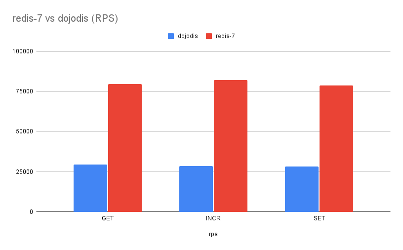

# dojodis 🍤

[dojodis] is an experimental high-performance [Redis][redis] clone written [Scala ZIO][zio].

## Supported Commands

dojodis server supports the following [Redis commands][commands]: [get], [set], [exists], [incr],
[incrby], [ping], [del], [keys]

## Development

```bash
sbt run

redis-cli -p 6666 set my_name "Oto Brglez"
redis-cli -p 6666 get my_name
cat test.txt | redis-cli -h 127.0.0.1 -p 6666
```

## Silly benchmark

Although this is considered to be a very experimental project I was really
tempted to make it compliant with [redis-benchmark] to see how it will perform.



Benchmark was ran against `Redis server v=7.0.0 sha=00000000:0 malloc=libc bits=64 build=efafb97113670c08`
and here are the results for the common test
suite. [Raw data can be found here.](https://docs.google.com/spreadsheets/d/1j7HTP2EndiljV50Twluc2WLb1pS3Nt9yf1puyMWETRo/edit?usp=sharing)

```bash
redis-benchmark -h 127.0.0.1 -p 6666 -t get,set,incr,incrby,del -n 100000 -c 4 --csv
```

## Resources

- [Architecture Notes - Redis Explained](https://architecturenotes.co/redis/)
- [RESP protocol spec](https://redis.io/docs/reference/protocol-spec/)
- [A Java Parallel Server Through the Ages](https://www.cs.unh.edu/~charpov/programming-futures.html)
- [Wrapping impure code with ZIO - Pierre Ricadat](https://medium.com/@ghostdogpr/wrapping-impure-code-with-zio-9265c219e2e)
- [zio-tcp - Richard Searle](https://github.com/searler/zio-tcp)
- [5 lessons learned from my continuing awesome journey with ZIO - Natan Silnitsky](https://medium.com/wix-engineering/5-lessons-learned-from-my-continuing-awesome-journey-with-zio-66319d12ed7c)
- [Thread Pool Best Practices with ZIO - John A De Goes](https://degoes.net/articles/zio-threads)
- [Detecting Client Disconnections Using Java Sockets - Zack West](https://www.alpharithms.com/detecting-client-disconnections-java-sockets-091416/)
- [ZIO / ZIO](https://github.com/zio/zio/issues/3649#issuecomment-631541249)
- [How to talk raw Redis](https://www.compose.com/articles/how-to-talk-raw-redis/)
- [Processing ZIO effects through a pipeline - Steven Vroonland](https://medium.com/@svroonland/processing-zio-effects-through-a-pipeline-c469e28dff62)
- [High-Concurrency Practices of Redis: Snap-Up System](https://www.alibabacloud.com/blog/high-concurrency-practices-of-redis-snap-up-system_597858)
- [kpodsiad / yamlator](https://github.com/kpodsiad/yamlator)
- [Inline your boilerplate – harnessing Scala 3 metaprogramming without macros](https://scalac.io/blog/inline-your-boilerplate-harnessing-scala3-metaprogramming-without-macros/)
- [From Scala 2 shapeless to Scala 3](http://www.limansky.me/posts/2021-07-26-from-scala-2-shapeless-to-scala-3.html)
- [Redis Protocol Compatibility](https://redis.pjam.me/post/chapter-5-redis-protocol-compatibility/)

## Authors

- [Oto Brglez / @otobrglez][otobrglez]


[dojodis]: https://github.com/otobrglez/dojodis

[redis]: https://redis.io

[zio]: https://zio.dev

[otobrglez]: https://github.com/otobrglez

[get]: https://redis.io/commands/get/

[set]: https://redis.io/commands/set/

[exists]: https://redis.io/commands/exists/

[incr]: https://redis.io/commands/incr/

[incrby]: https://redis.io/commands/incrby/

[ping]: https://redis.io/commands/ping/

[commands]: https://redis.io/commands/

[del]: https://redis.io/del/

[keys]: https://redis.io/commands/

[redis-benchmark]: https://redis.io/docs/reference/optimization/benchmarks/
